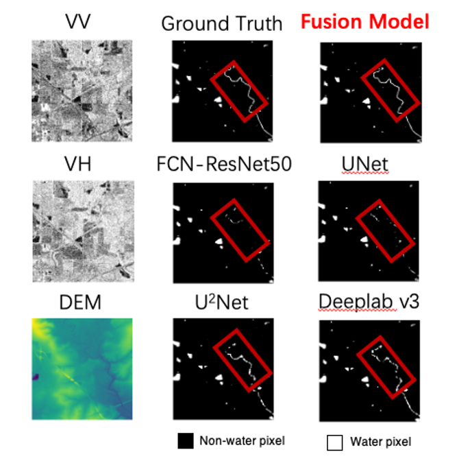

# Flood-detection

## Introduction

We provide a method for detecting floods in satellite images, which are processed by fusion of synthetic aperture radar and DEM data, and a good detection is obtained.

## Dataset Information

In this paper, we use the Sen1Floods11 dataset as the training set. Available Open access at:

http://openaccess.thecvf.com/content_CVPRW_2020/html/w11/Bonafilia_Sen1Floods11_A_Georeferenced_Dataset_to_Train_and_Test_Deep_Learning_CVPRW_2020_paper.html

The data used to detect the image uses data taken by the Sentinel-1 satellite. Available Open access at: https://github.com/sentinel-hub/sentinelhub-py 

## Training method

Run unet3.ipynb to start training.

## Example images

A sample of the result is provided at in `./sample`

  

